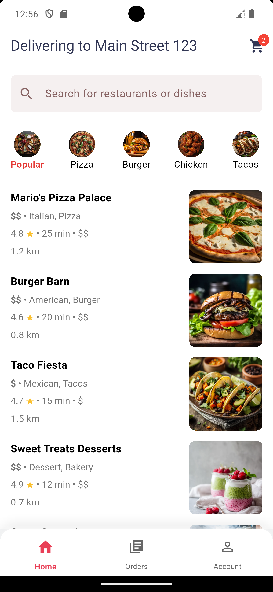
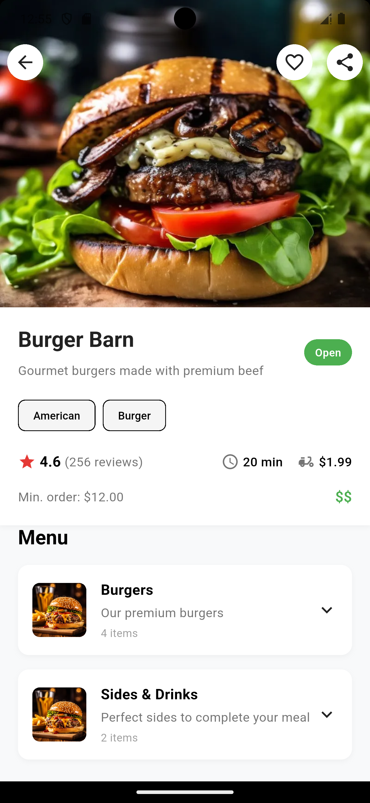
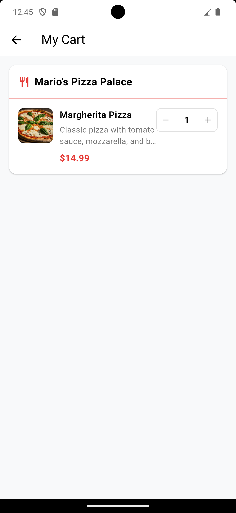
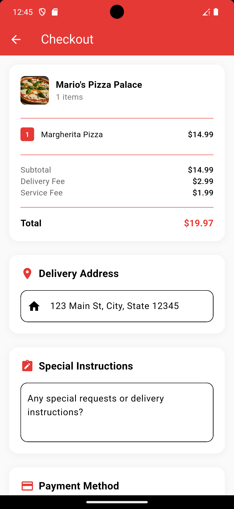
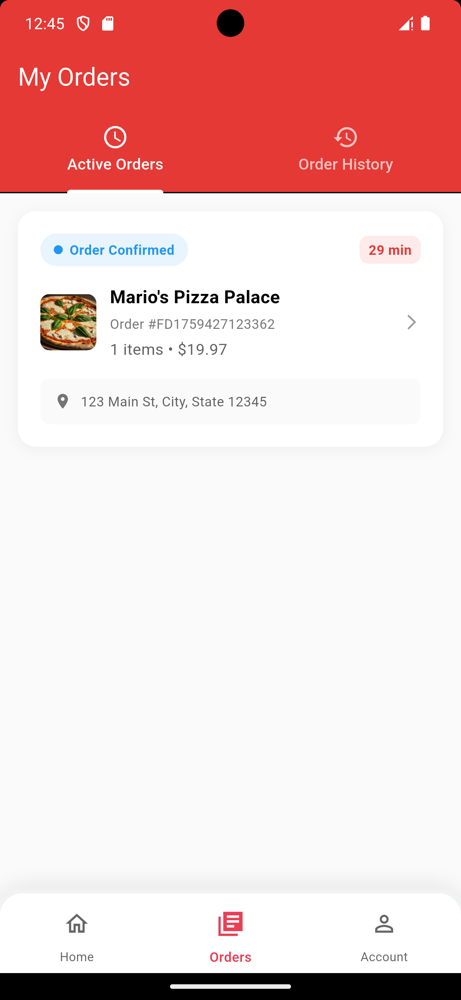
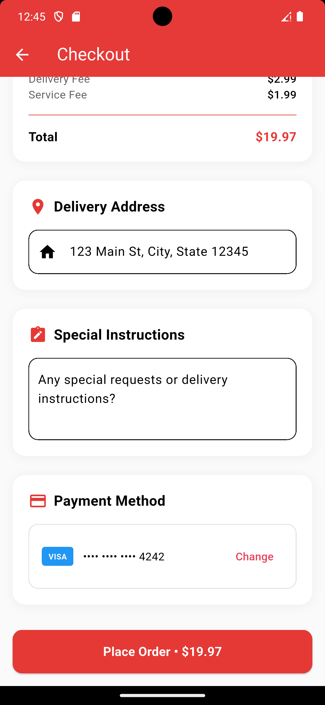
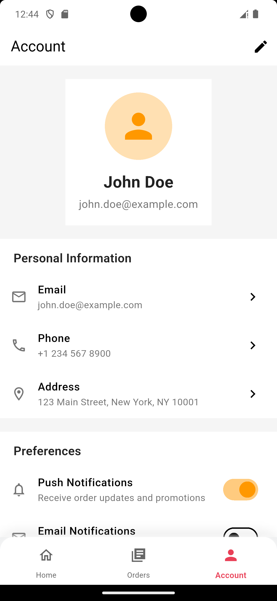
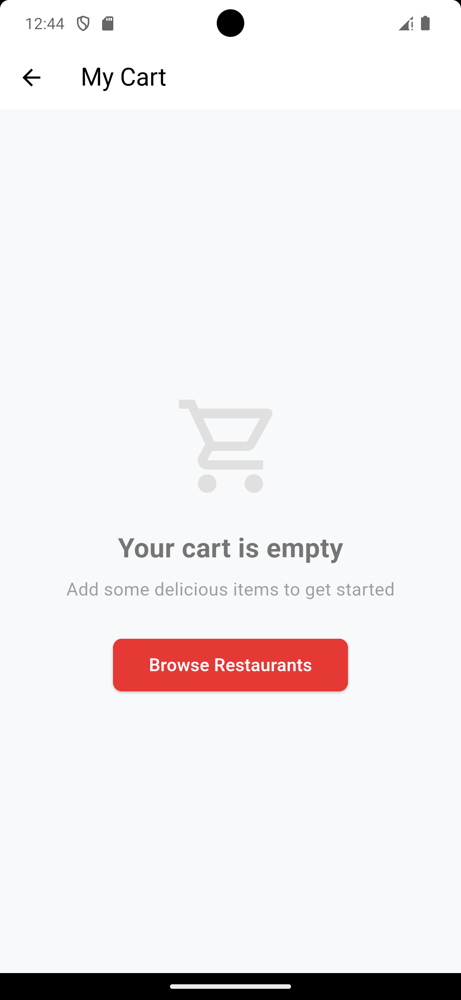

# 🍕 Food Delivery App

A modern Flutter food delivery application built with clean architecture, BLoC state management, and comprehensive testing.

## 📱 Screenshots

<div align="center">
  
  
  
  
</div>

<div align="center">
  
  
  
  
</div>

## ✨ Features

### 🏠 Home & Restaurant Discovery
- Browse restaurants by categories (Popular, Pizza, Burger, Chicken, Tacos)
- Browse restaurant by name
- Search functionality for restaurants and dishes
- Restaurant cards with ratings, delivery time, and distance

### 🍽️ Restaurant Details
- Detailed menu with categories and items
- Add items to cart with quantity selection
- Restaurant information and ratings
- Menu item descriptions with prices

### 🛒 Shopping Cart
- Add/remove items from cart
- Update item quantities
- Cart badge showing item count
- Grouped cart items by restaurant
- Cart summary with totals

### 💳 Checkout & Orders
- Order placement and confirmation
- Order tracking with real-time status
- Order history and management
- Multiple payment options

### 👤 User Profile
- User account management
- Settings and preferences

## 🏗️ Architecture

This project follows **Clean Architecture** principles with the following structure:

```
lib/
├── core/
│   └── themes/           # App theming
├── features/
│   ├── restaurant/       # Restaurant feature
│   │   ├── data/        # Data layer (repositories, datasources, models)
│   │   ├── domain/      # Domain layer (entities, use cases, repositories)
│   │   └── presentation/ # Presentation layer (pages, widgets, BLoC)
│   ├── cart/            # Cart feature
│   ├── order/           # Order feature
│   └── account/         # Account feature
├── routes/              # App routing
└── ui/                  # Shared UI components
```

### 🧱 Key Architectural Patterns
- **Clean Architecture** with separation of concerns
- **BLoC Pattern** for state management
- **Repository Pattern** for data access
- **Dependency Injection** with Flutter Modular
- **Use Cases** for business logic encapsulation

## 🛠️ Technologies & Packages

### Core Dependencies
- **Flutter SDK**: ^3.8.1
- **flutter_bloc**: ^9.1.1 - State management
- **flutter_modular**: ^6.4.1 - Dependency injection and routing
- **bloc**: ^9.0.1 - Business logic components
- **equatable**: ^2.0.7 - Value equality

### Development Dependencies
- **flutter_test**: Testing framework
- **bloc_test**: ^10.0.0 - BLoC testing utilities
- **mocktail**: ^1.0.3 - Mocking framework
- **flutter_lints**: ^5.0.0 - Linting rules

## 🚀 Getting Started

### Prerequisites
- Flutter SDK (^3.8.1)
- Dart SDK
- Android Studio / VS Code
- Android emulator or physical device

### Installation

1. **Clone the repository**
   ```bash
   git clone https://github.com/ferrykurniawan28/food-delivery.git
   cd food-delivery
   ```

2. **Install dependencies**
   ```bash
   flutter pub get
   ```

3. **Run the app**
   ```bash
   flutter run
   ```

### 🧪 Running Tests

Run all tests:
```bash
flutter test
```

Run tests with coverage:
```bash
flutter test --coverage
```

Run specific test files:
```bash
flutter test test/features/cart/presentation/bloc/cart_bloc_test.dart
```

## 📂 Project Structure

```
fooddelivery/
├── lib/
│   ├── main.dart                 # App entry point
│   ├── core/
│   │   └── themes/
│   │       └── app_theme.dart    # App theme configuration
│   ├── features/
│   │   ├── restaurant/
│   │   │   ├── data/
│   │   │   │   ├── datasources/  # Local/Remote data sources
│   │   │   │   ├── models/       # Data models
│   │   │   │   └── repositories/ # Repository implementations
│   │   │   ├── domain/
│   │   │   │   ├── entities/     # Business entities
│   │   │   │   ├── repositories/ # Repository interfaces
│   │   │   │   └── usecases/     # Business use cases
│   │   │   ├── presentation/
│   │   │   │   ├── bloc/         # BLoC state management
│   │   │   │   ├── pages/        # UI pages
│   │   │   │   └── widgets/      # UI widgets
│   │   │   └── di/
│   │   │       └── restaurant_module.dart # Dependency injection
│   │   ├── cart/                 # Similar structure for cart
│   │   ├── order/                # Similar structure for orders
│   │   └── account/              # Similar structure for account
│   ├── routes/
│   │   └── routes.dart           # App routing configuration
│   └── ui/
│       └── splash.dart           # Splash screen
├── test/                         # Test files
├── assets/
│   └── images/                   # App images
└── .github/                      # Screenshots
```

## 🧪 Testing

The project includes comprehensive unit tests covering:

### Test Coverage
- **Restaurant BLoC Tests**: 19 tests covering all events and states
- **Cart BLoC Tests**: 42 tests covering cart operations
- **Order Management Tests**: 35 tests for order lifecycle
- **Integration Tests**: 10 tests for end-to-end workflows
- **Entity Tests**: 46 tests for data models and business logic

### Test Categories
- **Unit Tests**: Individual component testing
- **Widget Tests**: UI component testing
- **Integration Tests**: End-to-end user workflows
- **BLoC Tests**: State management testing

### Running Specific Test Suites
```bash
# Restaurant feature tests
flutter test test/features/restaurant/

# Cart feature tests  
flutter test test/features/cart/

# Order feature tests
flutter test test/features/order/

# Integration tests
flutter test test/integration/
```

## 🔧 Configuration

### App Theme
The app uses a custom theme defined in `lib/core/themes/app_theme.dart` with:
- Primary color: Red (#0E53935)
- Material Design 3 principles
- Custom color scheme

### Routing
Navigation is handled by Flutter Modular with route definitions in `lib/routes/routes.dart`:
- `/` - Splash screen
- `/home` - Main home screen with bottom navigation
- `/restaurant/:id` - Restaurant details
- `/cart` - Shopping cart
- `/orders` - Order management

## 📱 State Management

The app uses **BLoC (Business Logic Component)** pattern for state management:

### BLoC Structure
- **Events**: User actions and system events
- **States**: UI state representations  
- **BLoC**: Business logic and state transitions

### Key BLoCs
- **RestaurantBloc**: Restaurant data and filtering
- **CartBloc**: Shopping cart management
- **OrderBloc**: Order processing and tracking

## 🤝 Contributing

1. Fork the repository
2. Create your feature branch (`git checkout -b feature/AmazingFeature`)
3. Commit your changes (`git commit -m 'Add some AmazingFeature'`)
4. Push to the branch (`git push origin feature/AmazingFeature`)
5. Open a Pull Request

## 👨‍💻 Author

**Ferry Kurniawan**
- GitHub: [@ferrykurniawan28](https://github.com/ferrykurniawan28)

---

**Built with ❤️ using Flutter**
